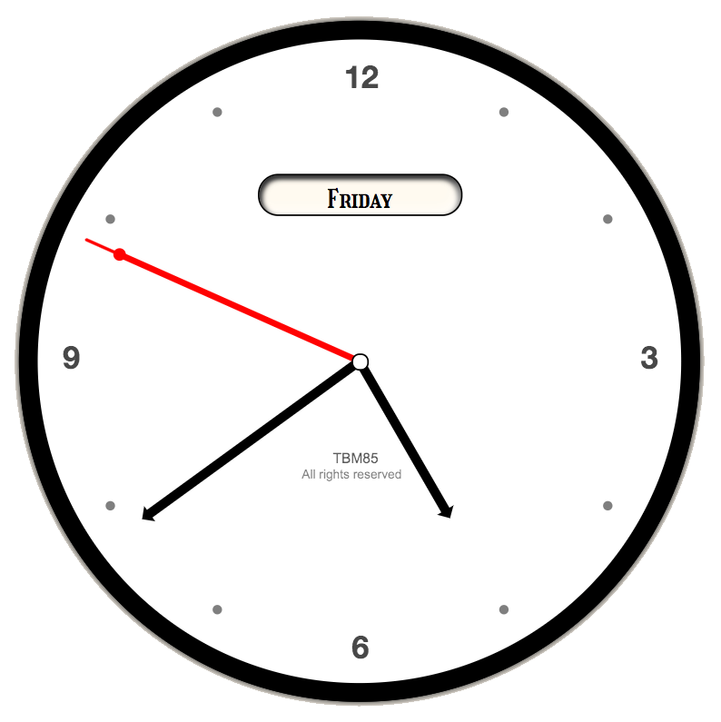

# Analog Clock
[Demo](https://tbm85.github.io/Demo-Analog-Clock/)

## Description
An analog clock made with Vanilla Js, CSS3 and HTML5.

## Resources
* [Girassol Font](https://fonts.google.com/specimen/Girassol#standard-styles)

## License
Copyright (c) 2021 Tania Ballester. This project is using [MIT License](LICENSE.md)